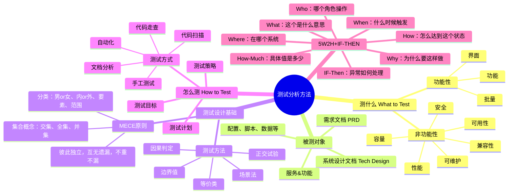
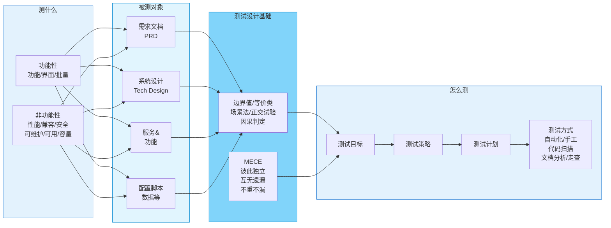
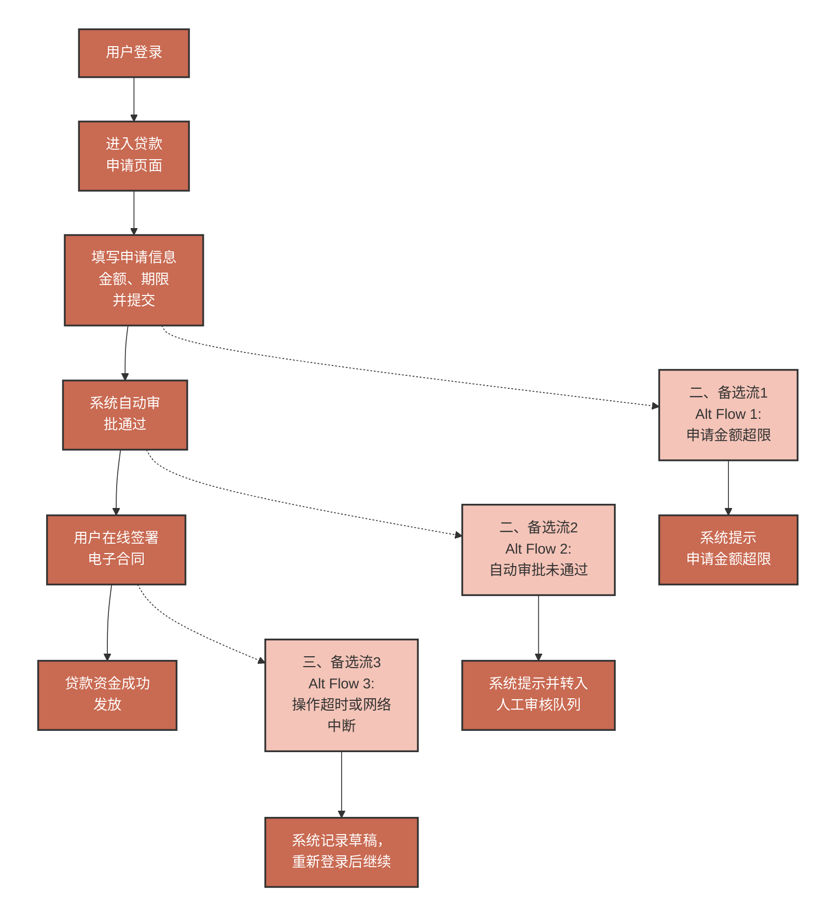

## 测试分析方法

### 整体架构思维导图



### 流程图



---

## 一、测什么 (What to Test)

### 1. 功能性测试
- **功能**：核心业务逻辑验证
- **界面**：用户界面交互验证
- **批量**：批量操作和数据处理验证

### 2. 非功能性测试
- **性能**：响应时间、吞吐量、资源使用率
- **兼容性**：跨平台、跨浏览器、跨设备兼容
- **安全**：权限控制、数据加密、漏洞扫描
- **可维护**：代码质量、可扩展性、文档完整性
- **可用性**：用户体验、易用性、可访问性
- **容量**：并发用户数、数据量、存储容量

---

## 二、被测对象

| 类型 | 说明 | 关注点 |
|------|------|--------|
| **需求文档 (PRD)** | Product Requirement Document | 需求完整性、一致性、可测试性 |
| **系统设计文档** | Tech Design | 架构合理性、技术可行性 |
| **服务&功能** | 实际功能模块 | 功能实现、边界条件、异常处理 |
| **配置、脚本、数据等** | 配置文件、脚本、数据库 | 配置正确性、脚本可靠性、数据完整性 |

---

## 三、测试设计基础 & MECE 原则

### 3.1 测试方法

#### 边界值分析
- 上点（边界值）
- 离点（边界外一个单位）
- 内点（边界内一个单位）

#### 等价类划分
- 有效等价类：合理的、有意义的输入数据
- 无效等价类：不合理的、无意义的输入数据

#### 场景法
- 基本流
- 备选流
- 异常流

**举例：贷款申请流程图**



**说明：**
- 实线箭头表示基本流（主流程）
- 虚线箭头表示备选流和异常流
- 深橙色节点为主流程步骤
- 浅橙色节点为备选流触发点

#### 正交试验（正交性筛选）- Pairwise算法(PICT)

**方法说明：** 是利用正交表科学安排与分析多因素实验的方法，适用于需减少实验次数的多因素研究场景。其核心思想是通过正交性筛选代表性水平组合，使实验点具备均匀分散、齐整可比特性，在保证效率的同时降低全面实验的资源消耗。

**分析步骤：** 分析需求、技术设计文档、产品参数等，找出所有可能影响输出结果的输入条件或系统配置参数，并为每个**因素**确定覆测试的水平。

**补充完善：** 基于测试经验，补充一些正交表中未包含但你认为重要的边界值、异常值等测试用例。

**举例：** 假设测试一个利率估算功能，其受三个因素影响，每个因素有两个水平：

- **因素A - 信用等级**：A1（良好）、A2（一般）
- **因素B - 贷款期限**：B1（≤1年）、B2（>1年）
- **因素C - 担保方式**：C1（抵押）、C2（信用）

全面测试需要 2×2×2=8个用例。我们选用以下正交表，只需4次测试。下表展示了如何根据正交表设计测试用例：

| 用例编号 | 信用等级 (A) | 贷款期限 (B) | 担保方式 (C) | 测试用例说明 |
|---------|-------------|-------------|-------------|-------------|
| 1 | 良好 (A1) | ≤1年 (B1) | 抵押 (C1) | 良好信用，短期贷款，有抵押 |
| 2 | 良好 (A1) | >1年 (B2) | 信用 (C2) | 良好信用，长期贷款，纯信用 |
| 3 | 一般 (A2) | ≤1年 (B1) | 信用 (C2) | 一般信用，短期贷款，纯信用 |
| 4 | 一般 (A2) | >1年 (B2) | 抵押 (C1) | 一般信用，长期贷款，有抵押 |

正交表保证了每个因素的水平均匀出现（如"良好"和"一般"信用等级各出现两次），并且任意两个因素的所有水平组合（如（良好，≤1年）、（良好，>1年）等）都出现了一次，达到了高效覆盖的目的（Pairwise算法）。

**适用：** 组合场景  
**不足：** 两两组合会有遗漏

#### 因果判定
- 输入条件的组合
- 输出结果的判定

### 3.2 MECE 原则

> **M**utually **E**xclusive, **C**ollectively **E**xhaustive  
> 相互独立，完全穷尽

**核心要点：**
- ✅ **彼此独立**：各分类之间互无遗漏，不重不漏
- ✅ **完全穷尽**：所有可能情况都被覆盖

**应用示例：**
- 📊 **集合概念**：交集、全集、并集
- 🏷️ **分类维度**：
  - 二元分类：男 or 女、内 or 外
  - 多元分类：要素、范围、层次

---

## 四、怎么测 (How to Test)

### 测试流程

```
测试目标 → 测试策略 → 测试计划 → 测试方式
```

### 4.1 测试目标
- 明确测试范围
- 定义验收标准
- 确定质量目标

### 4.2 测试策略
- 测试类型选择（功能、性能、安全等）
- 测试深度和广度
- 风险评估和优先级排序

### 4.3 测试计划
- 测试进度安排
- 资源分配
- 里程碑设定

### 4.4 测试方式

| 方式 | 说明 | 适用场景 |
|------|------|----------|
| 🤖 **自动化测试** | 使用工具脚本执行 | 回归测试、高频重复测试 |
| ✋ **手工测试** | 人工执行测试用例 | 探索性测试、用户体验测试 |
| 📝 **代码扫描** | 静态代码分析 | 代码质量、安全漏洞检查 |
| 📄 **文档分析** | 审查文档完整性 | 需求阶段、设计阶段 |
| 👁️ **代码走查** | 代码评审和审查 | 关键模块、复杂逻辑 |

---

## 五、5W2H + IF-THEN 分析法

这是一套全面的需求分析和测试设计方法，通过系统性提问来深入理解需求和设计测试用例。

### 5W2H 框架

| 维度 | 核心问题 | 测试关注点 |
|------|----------|-----------|
| **Why** | 为什么要这样做？有其他更好方法么？ | 需求合理性、方案优化 |
| **What** | 这个是什么意思？具体含义是什么？ | 需求理解、边界定义 |
| **When** | 什么时候触发这件事？什么时候操作？ | 时机、时序、并发 |
| **Who** | 哪个角色来操作？产品同学、财务、系统调度、出了问题谁来跟进？ | 权限、角色、责任划分 |
| **Where** | 在哪个系统？哪个地方都要在哪里维护？ | 环境、配置、数据一致性 |
| **How** | 怎么达到这个状态，这个怎么来的？ | 流程、步骤、依赖关系 |
| **How-Much** | 具体值是多少？可以支撑多大并发、超时设置多长时间？系统容忍度是多少？ | 性能指标、容量规划、阈值设置 |

### IF-THEN 异常分析

> 如果发生异常，系统应该如何响应？

**关键场景：**
- ⏱️ **超时场景**：网络超时、数据库查询超时、第三方服务超时
- ❌ **写失败场景**：数据库写入失败、文件写入失败、消息发送失败
- 🚨 **其他异常**：参数校验失败、权限不足、资源不足
- 🔄 **容错机制**：重试策略、降级方案、熔断机制

**设计要点：**
1. 明确异常类型和触发条件
2. 定义错误码和错误信息
3. 设计回滚和补偿机制
4. 记录日志和告警
5. 提供用户友好的错误提示

---

## 六、测试设计模板

### 完整测试流程

```
┌──────────────────────────────────────────────────────────┐
│                     需求分析阶段                         │
│  • 使用 5W2H 分析需求                                    │
│  • 使用 IF-THEN 分析异常场景                             │
└──────────────────┬───────────────────────────────────────┘
                   │
                   ▼
┌──────────────────────────────────────────────────────────┐
│                     测试设计阶段                         │
│  • 基于 MECE 原则设计测试用例                            │
│  • 应用边界值、等价类、场景法等测试方法                  │
└──────────────────┬───────────────────────────────────────┘
                   │
                   ▼
┌──────────────────────────────────────────────────────────┐
│                     测试执行阶段                         │
│  • 选择合适的测试方式（自动化/手工）                     │
│  • 按照测试计划执行                                      │
└──────────────────┬───────────────────────────────────────┘
                   │
                   ▼
┌──────────────────────────────────────────────────────────┐
│                     测试评估阶段                         │
│  • 分析测试结果                                          │
│  • 评估质量风险                                          │
│  • 输出测试报告                                          │
└──────────────────────────────────────────────────────────┘
```

### 快速检查清单

- [ ] 需求是否清晰明确？（5W2H）
- [ ] 异常场景是否考虑？（IF-THEN）
- [ ] 测试用例是否完整？（MECE）
- [ ] 测试方法是否合理？（边界值、等价类等）
- [ ] 测试方式是否高效？（自动化/手工）
- [ ] 测试覆盖率是否达标？
- [ ] 质量风险是否可控？

---

## 七、总结

一个完整的测试分析方法应该包括：

1. **明确测试对象**：知道测什么（功能性/非功能性）
2. **理解被测系统**：清楚测试的对象和范围
3. **应用科学方法**：使用 MECE、边界值、等价类等方法设计用例
4. **选择合适方式**：根据场景选择自动化或手工测试
5. **深入需求分析**：使用 5W2H+IF-THEN 全面分析需求

> 💡 **核心理念**：测试不仅是验证功能是否正确，更是对需求的深度理解和对质量的全面保障。

---

## 参考资源

- 软件测试基础理论
- MECE 分析法
- 5W2H 分析法
- 测试设计方法学
